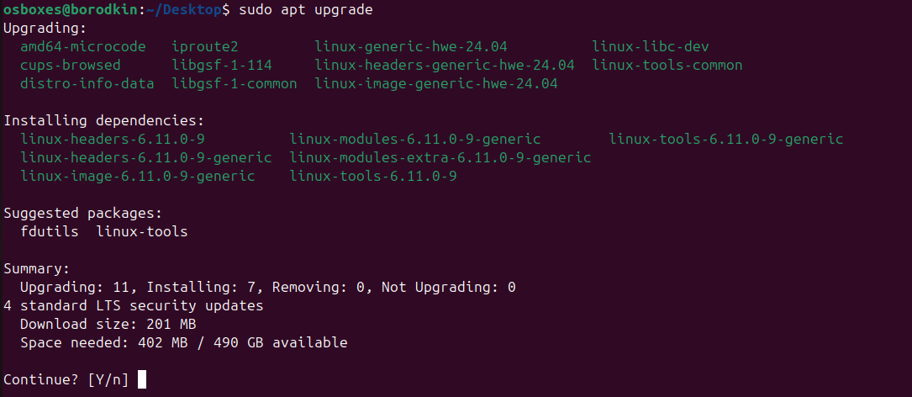
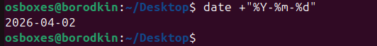
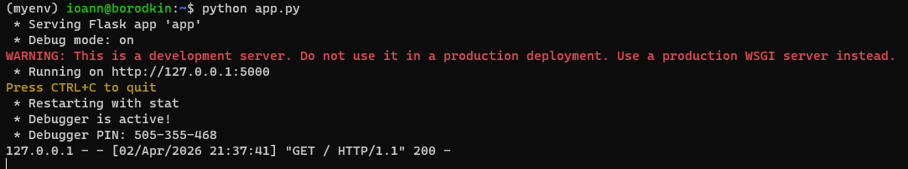
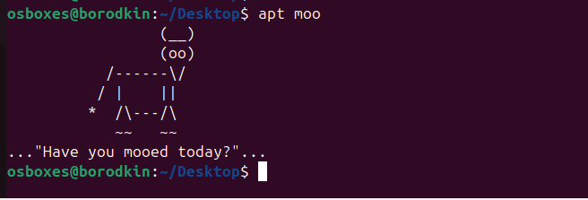
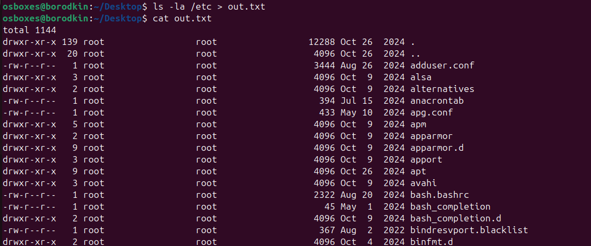
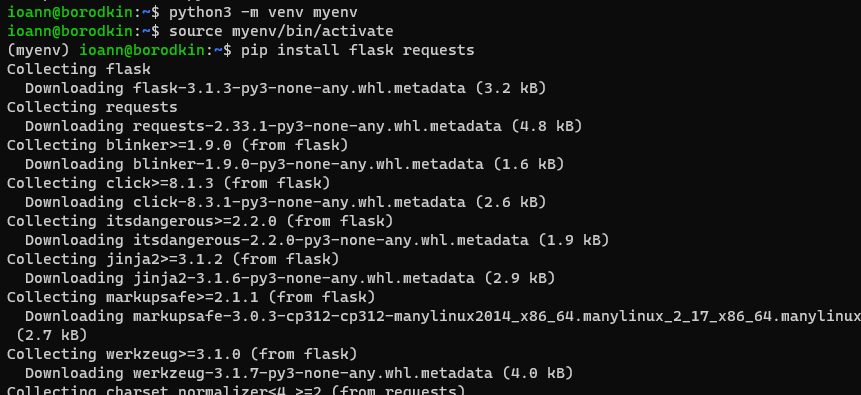
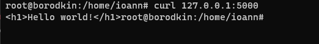

В отчете необходимо сделать скриншоты:  
1. update & upgrade  
- Обновление списка репозиториев Ubuntu с использованием sudo-привилегий  
- Запуск обновления системных пакетов в Ubuntu с отображением списка обновляемых компонентов.

2. date +"%Y-%m-%d"  
- Вывод текущей даты в формате ГОД-МЕСЯЦ-ДЕНЬ через команду dat

3. nano ls -la /etc  
- Перенаправление вывода команды ls -la /etc в файл out.txt и просмотр его содержимого.

4. apt moo  
- Вывод ASCII-арта через команду apt moo.

5. pip install flask requests  (venv)  
- Создание виртуального окружения Python и установка фреймворка Flask с зависимостями.  
- Установка библиотеки requests и её зависимостей в виртуальное окружение Python.

6. Hello world, теримнал, код  
- Создание простого веб-приложения на Flask с маршрутом, возвращающим HTML-страницу.  
- Запуск и отображение веб-приложения Flask с сообщением "Hello world!" в браузере.

